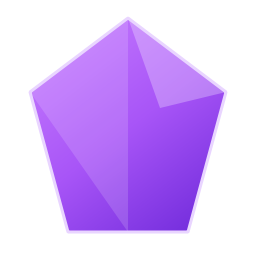
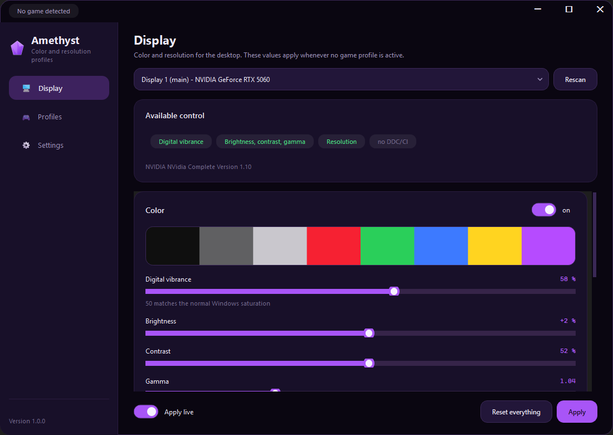
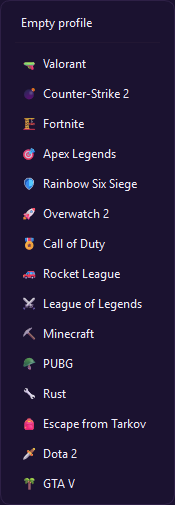
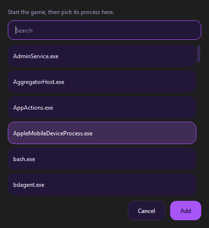
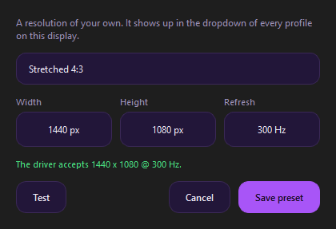
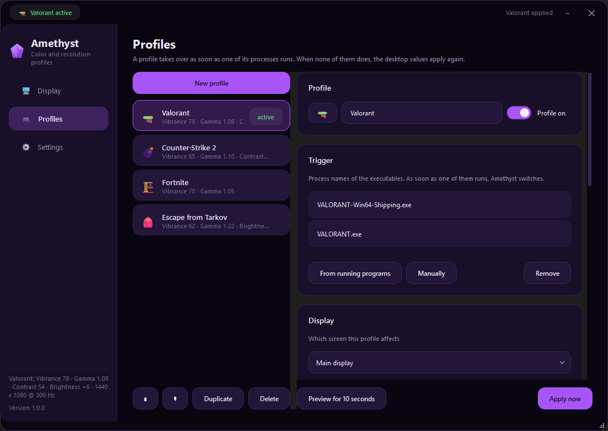
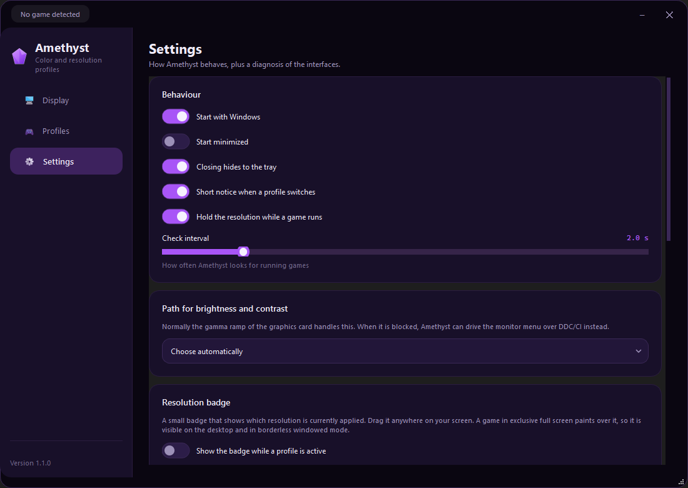

<div align="center">



# Amethyst

**Your colors and your resolution, per game, switched for you.**

Amethyst sets digital vibrance, brightness, contrast, gamma and resolution the way the NVIDIA
control panel does, but per game. Build a profile for Valorant, another one for CS2, and the
moment the game starts your screen switches over. When you close it, everything goes back.

[](https://imkirit.dev/amethyst)
[](https://github.com/ImKirit/Amethyst/releases/latest)
[](#install)

**[imkirit.dev/amethyst](https://imkirit.dev/amethyst)** shows what it does, with sliders you
can move yourself, and always links the newest build.



</div>

---

## Why?

Every competitive player has the same ritual: open the NVIDIA panel before a match, push
vibrance up, switch to a stretched resolution, then undo all of it afterwards because the
desktop looks radioactive.

So Amethyst binds those settings to the game's process instead of to your memory. Two
decisions make it safe to leave running: the state from before the first change is written to
disk, so a crash cannot leave your screen tinted, and resolution changes are temporary, so
they never survive a reboot.

## Getting started

1. **Install and launch Amethyst.** The Display page shows what your machine supports before
   you change anything.

2. **Create a profile.** Click **New profile** and pick a template. Fifteen games come with
   their process names and a starting point.

   

3. **Check the trigger.** For anything without a template, start the game and use
   **From running programs**.

   

4. **Dial in the look.** Color and resolution sit in one panel each. **Preview for 10 seconds**
   puts a profile on the real screen and takes it back off.

   

5. **Start the game.** Amethyst switches within a second or two and restores your desktop when
   the game closes.

## Features

### Tune

- **Digital vibrance** on the NVIDIA scale, 0 to 100 with 50 as normal. It runs through the
  driver, so it applies inside full screen games.
- **Brightness, contrast, gamma** and a per channel **color balance**, same ranges as the
  panel: -50 to +50, 0 to 100, 0.30 to 2.80, 50 to 150 percent.
- **Resolution and refresh rate**, custom modes included. Anything off the native aspect ratio
  is labelled **stretched**.
- **Create preset** for a resolution the driver does not list. Type width, height and refresh
  rate, and Amethyst asks the driver whether it would accept it before saving.

  

### Automate

- **Process triggers.** A profile lists the executables that activate it, several per profile
  if a game ships more than one.
- **The resolution stays put.** Games set the display mode themselves in full screen, and
  Windows restores it on alt tab. Amethyst checks four times a second and puts your profile
  resolution back.
- **Fifteen templates**, from Valorant and CS2 to Tarkov and GTA V.
- **Tray and autostart.** Closing keeps it running, the tray menu applies any profile by hand.

### Stay in control

- **Nothing is left behind.** The gamma ramp, vibrance and display mode from before the first
  change go to disk. If Amethyst is killed, the next start restores them.
- **Honest diagnostics.** The Display page names what works on your machine and why something
  does not.
- **An optional badge** showing whether you are on a stretched or a native mode, draggable
  anywhere.
- **Updates itself** from the releases of this repository.
- **A normal window.** Minimize, maximize and close where you expect them, drag it against the
  top edge to maximize or against a side to snap it to half the screen, drag the edges to
  resize. Its size and position come back the next time you open it.

## Screens

| | |
|---|---|
| **Display.** Desktop color and resolution. | **Profiles.** List left, editor right. |
|  |  |
| **While gaming.** The active profile is marked. | **Settings.** Behaviour, badge, updates, diagnostics. |
|  |  |


## What works on your machine

| Setting | Needs |
|---|---|
| Digital vibrance | NVIDIA GPU with driver |
| Brightness, contrast, gamma, color balance | the Windows gamma ramp |
| Brightness and contrast, fallback | monitor with DDC/CI enabled |
| Resolution and refresh rate | any GPU |

**If the color sliders are greyed out**, the Display page names the cause. Usually one of
these: a kernel anti-cheat such as Riot Vanguard blocks the gamma ramp for every program, the
NVIDIA panel included, because it is the same Windows call; HDR or automatic color management
is on for that monitor; or Windows clamps the range until `GdiIcmGammaRange` is set, for which
Settings has a button.

## Stretched resolutions

Amethyst switches the resolution. Whether the picture is then stretched or letterboxed is
decided by the driver, so set that once: NVIDIA panel, **Adjust desktop size and position**,
scaling mode **Full-screen**, **perform scaling on GPU**, and tick the override.

## How data is stored

```
%LOCALAPPDATA%\Amethyst\
├── profiles.json     your game profiles, in order of priority
├── settings.json     behaviour plus the desktop profile
├── baseline.json     state from before the first change, deleted on a clean exit
└── amethyst.log      what was applied and what was refused
```

Plain JSON, no database. Delete the folder and Amethyst starts fresh.

## Install

**Windows 10 or 11.** An NVIDIA card is needed for digital vibrance, everything else works on
any GPU.

**1. Download the release.** Grab `Amethyst.exe` from the
[latest release](https://github.com/ImKirit/Amethyst/releases/latest) and run it. One file, no
installer. It updates itself from then on. SmartScreen warns because the file is not signed:
More info, then Run anyway.

**2. Build it yourself.**

```bash
git clone https://github.com/ImKirit/Amethyst.git
cd Amethyst
pip install -r requirements.txt
python tools/build.py
```

## Development

```bash
pip install -r requirements.txt     # PySide6, the only dependency
python -m amethyst                  # run from source, with console output
python tools/screenshots.py         # regenerate the images in docs/img
python tools/build.py               # package as dist/Amethyst.exe
```

The Windows side is plain `ctypes`: `amethyst/winapi/` holds one module per capability
(`gamma`, `nvapi`, `displays`, `ddcci`, `processes`, `autostart`), each reporting whether it
works instead of raising. `engine.py` decides which profile is active and owns the baseline.
Everything under `amethyst/ui/` is PySide6 with one stylesheet in `ui/theme.py`.

## License

[MIT](LICENSE) © ImKirit
